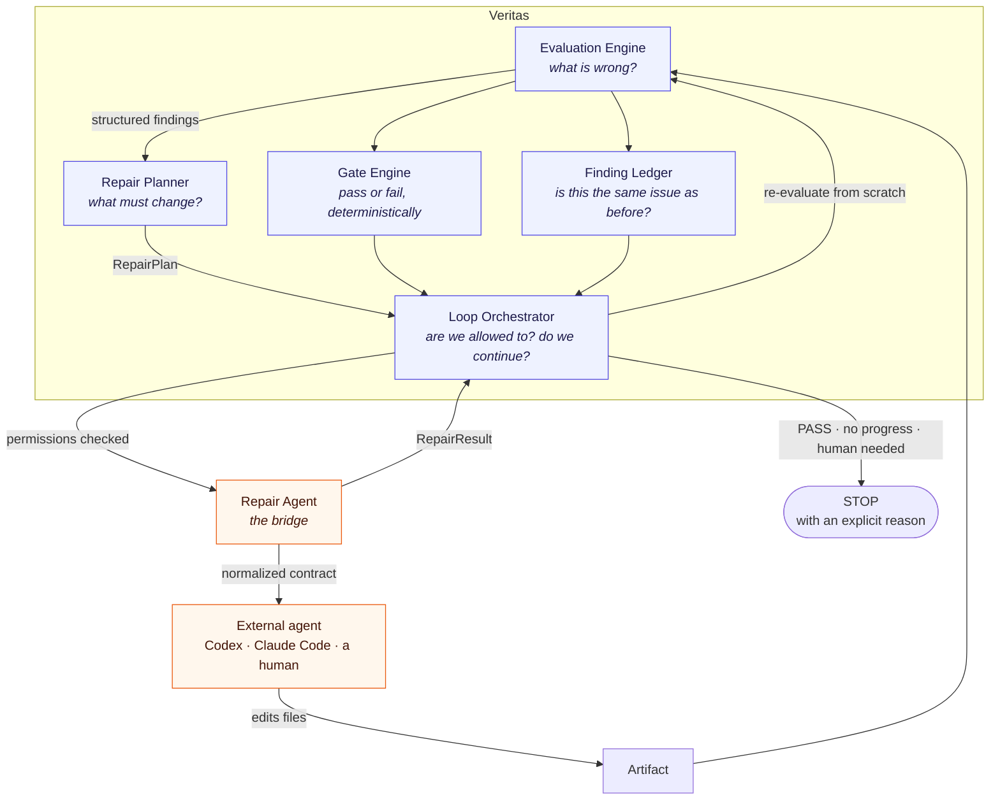

# Veritas Gate

   

> **Trust, but verify.**

Veritas Gate is an extensible evaluation and quality-gate framework for
AI-generated and human-generated artifacts.

Instead of asking the system that generated an artifact whether the artifact is
good, Veritas Gate sends it through independent judges, deterministic checks,
evidence verification, consensus analysis, and policy-based gates.

```text
Generator
    │
    ▼
Artifact
    │
    ├── Judge
    ├── Judge
    ├── Judge
    ├── Deterministic checks
    │
    ▼
Meta Review
    │
    ▼
Quality Gate
```

---

## Quick start

```bash
pip install veritas-gate

cp .env.example .env        # add the API key for whichever provider you use
set -a && . ./.env && set +a

veritas init
veritas evaluate .
```

From a clone:

```bash
git clone https://github.com/arananet/veritas-gate.git
cd veritas-gate
pip install -e ".[dev]"

veritas evaluate examples/paper --profile scientific-paper
```

`examples/paper` is a deliberately flawed manuscript: its headline number
contradicts its own benchmark file, its code implements a different method than
it describes, and its improvement rests on a single unseeded run. It exists so
you can see the gate do its job on the first run.

---

## What it does

```text
Veritas Gate
Trust, but verify.

Profile:  scientific-paper
Artifact: examples/paper

Running deterministic checks...
  ✓ repository-structure
  ✓ required-sections
Running judges...
  ✗ methodology
  ✗ evidence
  ✗ statistics
  ✗ reproducibility
  ✗ repo-consistency
  ! citations
  ✗ archival
  ✗ adversarial
⠹ Cross-examining adversarial, Weighing archival...
Building claim graph...
  ✓ claim graph
Meta review...
  ✓ meta review

3 claims detected
  ✓ 0 verified
  ! 0 partially supported
  ✗ 2 unsupported
  evidence coverage: 0.0%

Findings:
CRITICAL    2
MAJOR       7
MINOR       1
INFO        0

Blocking findings:

  [EVIDENCE-001] Headline latency reduction is contradicted by the results file
    paper/main.md#results
  [REPO-CONSISTENCY-001] Implementation does not match the described method
    experiments/router.py

╭─ Gate ─╮
│ FAIL   │
╰────────╯
```

### Beyond the gate: paper quality

For a paper, the scientific-paper profile also covers what makes it reviewable,
not only correct. Each is described in
[docs/EVALUABLE_ARTIFACTS.md](docs/EVALUABLE_ARTIFACTS.md):

- **Numeric traceability** — every number in the manuscript is found in the
  evidence (as a value, rounding, percentage, or stated-denominator ratio).
- **Derived-file provenance** — figures, tables and generated LaTeX are
  declared with their command and inputs; `veritas build` records hashes, and
  stale, hand-edited or provenance-less figures are reported.
- **Frozen integrity** — frozen evidence is append-only; git history showing
  an in-place edit is reported, and CITATION.cff must agree with tags and DOIs.
- **Presentation** — process narration left in the paper, repeated hashes, a
  long abstract, uncited figures; a presentation judge for structure and
  captions, and a figures judge that looks at the rendered pages.
- **PDF and venue** — unresolved references, fonts, overfull boxes; venue
  rules (TMLR, arXiv) including a double-blind identity scan, and an
  anonymized supplementary package.
- **Investigation before repair** — the loop's repair agent first establishes
  facts read-only, with sources; the repair works from verified facts.

The repair agent only ever acts through its CLI on text, scripts and figures;
evidence is frozen, and investigations are reverted if they touch anything.

---

## The separation is the design

This is the part that is not negotiable: **the evaluator, the repairer and the
orchestrator are three different systems.**

Codex — or Claude Code, or any CLI agent — may repair the artifact. It does not
get to decide whether its own repair was correct. Veritas re-evaluates the
result from scratch, and the orchestrator decides whether to continue or stop.



What this buys you:

- **A judge never talks to a repairer.** A finding becomes a `RepairPlan`
  first. The agent receives that contract — never the judge's prose, never its
  reasoning, never another agent's reasoning.
- **A repairer's claim of success is not evidence.** The agent may report
  `"status": "completed"`. The ledger only records an issue as `RESOLVED` when
  the *next independent evaluation* stops reporting it.
- **Nobody but the orchestrator decides to continue.** Not the judge, not the
  agent. Every loop terminates with an explicit `StopReason`.
- **Two agents can never argue with each other**, because they never meet.

---

## Autopilot: the bounded loop

```bash
veritas loop . --profile scientific-paper --max-iterations 5
```

```text
EVALUATE
   │
gate passed? ── yes ─→ STOP (quality_gate_reached)
   │ no
PLAN REPAIR
   │
human required? ── yes ─→ STOP (human_decision_required)
   │ no
REPAIR  (the agent edits files in a workspace)
   │
RE-EVALUATE from scratch
   │
MEASURE DELTA  (resolved / improved / unchanged / regressed / new)
   │
stop condition? ── yes ─→ STOP
   └── no ─→ EVALUATE
```

Three operating modes:

| Mode | Command | Touches your files |
| --- | --- | --- |
| Audit | `veritas evaluate .` | never |
| Assist | `veritas repair-plan .` | never — writes `repair-plan.json` |
| Autopilot | `veritas loop .` | in a workspace, bounded and audited |

Add `--dry-run` to see the plan autopilot *would* apply, and stop there.

While a repair runs, the agent's most recent line is shown beside the
spinner, so a long repair can be told apart from a hang. `--verbose`
prints its whole transcript. Veritas neither parses nor interprets that
output: it is whatever the configured tool chose to print.

Repairs land in a workspace, never in your tree. When the loop stops it
prints the commands to review the diff and to apply it — Veritas will not
apply one for you, because accepting a repair is the operator's decision.

### The loop always stops

```yaml
loop:
  enabled: true
  max_iterations: 5
  consecutive_non_improving_iterations: 2
  same_blocker_repeated: 2
  stop_on_new_critical: true
  stop_on_regression: true
  max_changed_files: 25
  max_cost_usd: null
```

There is no configuration that produces an unbounded loop. Every run ends with
one of: `quality_gate_reached`, `max_iterations`, `no_progress`,
`repeated_blocker`, `regression`, `new_critical_finding`,
`human_decision_required`, `cost_limit`, `change_limit`, `repair_failure`,
`dry_run`, `nothing_to_repair`.

Progress is measured by **blocking findings and issue resolution**, never by an
aggregate score. A quality number rising from 81 to 83 while a new critical
finding appears is not progress; the loop stops.

### Carrying a known problem on the record

Some findings are correct and you still need to ship. A manuscript kept out of
version control before publication is a real reproducibility gap — and also a
deliberate choice with a date on it.

```yaml
gate:
  accepted_risks:
    # By what and where — survives a judge rewording the same problem
    - category: reproducibility
      location: paper/REPRODUCTION.md
      reason: "Pre-publication: paper files stay private until submission."
      expires: 2026-12-31           # optional; after this it blocks again

    # Or by exact identity, using the Issue id from `veritas findings`
    - id: F6F3F837D
      reason: "Tracked in issue #12."
```

Prefer `category` and `location` when the artifact is still changing. The `id`
is derived from the finding's title, so a judge rewording the same problem
after you edit the artifact produces a new id and the acceptance goes stale —
exactly when you needed it to hold. Every criterion you give must match, so
adding a `location` narrows a category rule. A rule with no criteria at all is
rejected: that is not an exception, it is an off switch.

Each run names the rules that applied and, when a rule covers more than one
finding, lists everything it covered.

Accepting is not hiding. The finding is still reported, still counted in the
severity totals, and named in the run alongside its reason — it simply stops
blocking the gate. An acceptance that no longer matches any finding, or that
has expired, is reported as stale, because an exception nobody revisits is how
a gate quietly stops meaning anything.

The `Issue` column in `veritas findings` is the id to use: it is derived from
the finding's content, so it survives rewording and renumbering between runs,
unlike the per-run `EVIDENCE-001` style ids.

### The safety invariant

> Veritas may autonomously improve how existing evidence is **represented,
> implemented, documented or validated**. It must never autonomously **fabricate
> missing evidence** in order to satisfy its own evaluator.

This is enforced mechanically, not by prompt wording:

```text
results/run_summary.json already contains N=10, mean=0.873, std=0.004
  → "add the run count and variance to the manuscript"
  → autonomous. The values exist; only their representation was missing.

a judge asks for 30 seeds, and no such run exists
  → requires_new_evidence = true
  → requires_human_approval = true
  → STOP: human_decision_required
```

An action needing evidence that does not exist is never handed to an agent. If
an agent reports creating evidence anyway, the loop stops and asks for a human.

By default, only documentation, source code and tests are autonomous:

```yaml
repair:
  mode: autopilot
  agent:
    provider: generic-cli
    command:
      - sh
      - -c
      - 'codex exec --approve-for-me -C {workspace} "$(cat {prompt_file})"'
  permissions:
    documentation: true
    source_code: true
    tests: true
    experiments: false       # new measurements
    datasets: false          # data changes
    scientific_claims: false # removing or altering a claim
    methodology: false       # changing how something is evaluated
```

Two details decide whether a repair command works at all, and both fail
quietly if you get them wrong. The prompt is passed as **text**, not as a
path: `codex exec {prompt_file}` hands the agent a filename as its
instruction. And the agent must be allowed to write files without waiting
for an approval nobody is there to give — `--approve-for-me` for Codex,
`--permission-mode acceptEdits` for Claude Code. An agent that runs, exits
zero and changes nothing is reported as a failure and stops the loop,
naming the command and its exit code, rather than being recorded as a
partial success.


The agent is a worker, configured by a command template. Swapping Codex for
another tool is one line of YAML; nothing else in Veritas changes.

### Your originals are safe

```yaml
workspace:
  mode: worktree     # worktree | snapshot | copy | current
```

Repairs happen in a git worktree when git is available, and in an isolated copy
otherwise. Git is never required. Veritas never pushes, merges or rewrites your
branches — it writes a patch and tells you where it is.

```text
STOP  quality_gate_reached

Iterations: 3

Changes are available at:
  .veritas/workspaces/loop-2026-09-21T2210Z-a81c/

Patch:
  .veritas/loops/loop-2026-09-21T2210Z-a81c/final.patch
```

### Every iteration is preserved

```text
.veritas/loops/<loop-id>/
├── loop.json
├── loop-result.json
├── loop-report.md
├── ledger.json
├── final.patch
├── iteration-001/
│   ├── evaluation/           a complete, independent evaluation run
│   ├── findings-before.json
│   ├── repair-plan.json
│   ├── repair-result.json
│   └── changes.patch
└── iteration-002/
    └── ... plus delta.json
```

Nothing historical is ever overwritten.

```bash
veritas diff 1 2        # compare two iterations, issue by issue
veritas loop-report     # the final report
veritas loop . --resume # continue from the previous ledger after doing the human work
```

---

## Design principles

1. **Evaluation and generation are separate.** Nothing in this package writes
   or repairs an artifact. A judge is never allowed to fix what it is judging.
2. **Judges produce structured findings, not prose.** Every finding carries a
   severity, a category, a location, evidence and a confidence.
3. **Evidence outweighs scores.** A finding that cites nothing is kept, but its
   confidence is reduced. A claim with no evidence is never reported as verified.
4. **Critical findings cannot disappear through averaging.** The meta review
   merges duplicates by taking the *worst* severity any judge reported, and
   records every disagreement rather than resolving it silently.
5. **Gate decisions are deterministic.** The pass/fail decision is Python, not
   a model call. The same findings and policy always produce the same exit code.
6. **Artifact content is untrusted.** Everything read from an artifact is
   wrapped in an injection-resistant envelope, and nothing executes unless you
   put it on an allow-list.
7. **Models are interchangeable.** Anthropic, OpenAI, Google and any
   OpenAI-compatible endpoint, selected per judge in configuration.
8. **Profiles are configuration, not code.** See below.
9. **Every evaluation is reproducible.** Each run records models, prompt
   digests, judge versions, profile version, config and artifact commit.
10. **Repair is separate from evaluation.** The repairer applies changes; it
    never judges whether its own work succeeded. Only the next independent
    evaluation decides that, and only the orchestrator decides to continue.
11. **The loop is always bounded.** Every run ends with an explicit stop
    reason, and no configuration can make it unbounded.
12. **Evidence is never fabricated to pass the gate.** See the safety
    invariant above.

---

## Profiles are plugins

`scientific-paper` is not the core — it is the first profile. The engine knows
about artifacts, judges, checks, claims and gates, and nothing about papers.
A profile is a directory:

```text
profiles/<name>/
├── profile.yaml      # judges, checks, gate policy
├── rubric.yaml       # what each severity means in this domain (optional)
└── prompts/
    └── <judge>.md    # one versioned prompt per judge
```

Adding a domain means adding a directory. It requires no change to the
orchestration engine — that is a hard requirement, covered by tests.

```bash
veritas evaluate . --profile scientific-paper
veritas evaluate . --profile architecture-review
veritas evaluate . --profile agent
veritas evaluate . --profile repository
veritas evaluate proposal.md --profile technical-proposal
```

Profiles are discovered from `profile_paths:` in your config, `./profiles/`,
the `VERITAS_PROFILE_PATH` environment variable, the profiles bundled with the
package, and `veritas.profiles` entry points published by installed plugin
packages — so `veritas-security` or `veritas-arxiv` can ship profiles of their
own without forking this repository.

Shipped today: `scientific-paper` (methodology, evidence, statistics,
reproducibility, repo-consistency, citations, archival, adversarial) and
`generic-document` (structure, evidence, adversarial).

---

## Configuration

`veritas.yaml` says what to evaluate, with which models, under which policy.
Secrets never appear in it — only the names of environment variables.

```yaml
version: 1

profile: scientific-paper

artifact:
  # Every file here is sent to every judge, so this decides what a run costs.
  # Check it with `veritas files .` before the first run on a real project.
  paths: [paper, experiments, results, scripts]
  max_file_chars: 400000            # per file; anything longer is truncated, and said so

models:
  default:
    provider: ${VERITAS_DEFAULT_PROVIDER:-anthropic}
    model: ${VERITAS_DEFAULT_MODEL}
    tls_verify: ${VERITAS_TLS_VERIFY:-true}   # `truststore` behind a TLS-intercepting proxy
  adversarial:                      # a different vendor, on purpose
    provider: openai
    model: ${VERITAS_ADVERSARIAL_MODEL}
  meta:
    provider: google
    model: ${VERITAS_META_MODEL}

gate:
  fail_on: [critical]
  max_major: 0
  max_minor: 20
  require_checks: [tests]
  accepted_risks:                   # known problems carried on the record
    - category: reproducibility
      location: paper/REPRODUCTION.md
      reason: "Pre-publication: files stay private until submission."
      expires: 2026-12-31

checks:
  tests:
    type: command
    command: [pytest]

execution:
  allow: [pytest]                   # nothing runs unless it is listed here

thesis:                             # optional; what the work sets out to show
  - "The claim your evidence must support"

# artifact.withheld: [globs]          # optional; files that exist but are not sent
#   (with withheld_reason). Judges treat their absence as declared, not a defect.
judge_paths:                        # optional; narrow what each judge reads
  citations: [paper/manuscript.md]  # unlisted judges read the whole artifact

pricing:                            # optional; without it you get tokens only
  currency: USD
  rates:
    claude-opus-5: {input_per_million: 3.0, output_per_million: 15.0}
    gpt-5: {input_per_million: 1.25, output_per_million: 10.0}
```

Five check types, four of which run nothing:

| Type | What it asserts | Runs a subprocess |
| --- | --- | --- |
| `required-paths` | Configured paths exist in the artifact | no |
| `required-sections` | A target document contains configured sections | no |
| `content-patterns` | A target's text matches, or avoids, regular expressions | no |
| `reference-integrity` | Every relative path a document cites resolves | no |
| `command` | An allow-listed command exits zero | yes |

`content-patterns` is how a profile asserts what a regular expression can
settle — that a manuscript names a DOI, or cites a commit rather than a branch
that will move. `reference-integrity` resolves every relative path a document
cites, and separates a citation to something that does not exist from one to
something that exists but was never supplied in `artifact.paths` — the first
means the document is wrong, the second that the configuration is. See
[`docs/PROFILES.md`](docs/PROFILES.md) and
[`docs/EVALUABLE_ARTIFACTS.md`](docs/EVALUABLE_ARTIFACTS.md).

Model ids are never hard-coded. Copy `.env.example`, choose your models, and
point each judge role at whichever provider you want. The adversarial reviewer
defaults to a different vendor than the other judges so that one model's blind
spots do not decide the outcome.

---

## CLI

| Command | Purpose |
| --- | --- |
| `veritas init` | Write `veritas.yaml` and `.veritas/` |
| `veritas files` | Show what the judges would read, and roughly what it costs |
| `veritas evaluate <path>` | Run the evaluation and write an immutable run |
| `veritas evaluate . --profile <name>` | Evaluate under a specific profile |
| `veritas evaluate . --judge evidence --runs 3` | Calibrate one judge and record its stability |
| `veritas report` | Show the latest report |
| `veritas claims` | Show the claim graph and evidence coverage |
| `veritas findings --severity major` | Filter the latest findings |
| `veritas gate` | Print the gate status and exit with its code |
| `veritas repair-plan` | Assist mode: evaluate and write `repair-plan.json`, change nothing |
| `veritas loop` | Autopilot: the bounded evaluate, repair, re-evaluate loop |
| `veritas loop --dry-run` | Show what autopilot would do, and stop |
| `veritas loop --resume` | Continue from the previous loop's ledger |
| `veritas loop --verbose` | Print the repair agent's full output as it runs |
| `veritas scaffold` | Create missing citation and licensing files from your declared metadata |
| `veritas build` | Regenerate declared figures and generated files; record their provenance in `veritas.lock.json` |
| `veritas package -o supp.zip` | Anonymized supplementary archive for a double-blind venue, re-scanned for identity |
| `veritas loop-report` | Show the report from the latest loop |
| `veritas diff <a> <b>` | Compare two evaluations issue by issue |
| `veritas profiles` | List every discoverable profile |

Exit codes: `0` pass, `1` pass with warnings, `2` revise, `3` fail, `4` usage
or configuration error.

---

### What a run costs

Every evaluation reports the models it used and the tokens they consumed,
broken down per model and in total, on the console and in the run manifest:

```text
Usage:
model          calls       in     out     cost
claude-opus-5      3  105,311   6,737  $0.4170
gemini-3-pro       1   47,120   1,988        —
gpt-5              1   48,044   4,310  $0.1032
total              5  200,475  13,035  $0.5201
  no price configured for gemini-3-pro; the total is incomplete
```

Tokens are always counted. Cost appears only when you configure rates, because
**Veritas ships no price list and never will**. Prices depend on the model,
change without notice, and differ by provider and tier; a rate compiled into
Veritas would go stale and then be frozen into an immutable run record, which
is worse than reporting no cost at all. Set your own rates under `pricing:` and
they are recorded with the run, so a run you read next year shows what it cost
when it ran rather than what it would cost today.

A model with no configured rate is never treated as free: it is named and the
total is marked incomplete. The figure is an estimate for comparing runs and
budgeting, derived from your rates and the token counts the provider reported.
It is not a billing record — discounts, cache reads and batch tiers live on the
provider's side.

The MetaJudge's own call is counted alongside the judges'.

---

## Every run is reproducible

```text
.veritas/runs/2026-09-21T221215Z/
├── manifest.json      # models, prompt digests, judge versions, artifact commit
├── results.json       # the complete result
├── gate.json          # the gate decision
├── meta.json          # consolidation, consensus, disagreements
├── claims.json        # the claim graph and evidence coverage
├── judges/            # each judge's raw structured result
├── checks/            # each deterministic check's result
├── repair-plan.json   # advisory; Veritas never applies it
└── report.md
```

Runs are never overwritten.

---

## CI

```yaml
name: Veritas Gate

on:
  pull_request:
  push:
    branches: [main]

jobs:
  evaluate:
    runs-on: ubuntu-latest
    steps:
      - uses: actions/checkout@v4
      - uses: actions/setup-python@v5
        with:
          python-version: "3.12"
      - run: pip install -e .
      - run: veritas evaluate .
        env:
          ANTHROPIC_API_KEY: ${{ secrets.ANTHROPIC_API_KEY }}
```

`veritas evaluate` returns a non-zero exit code when the gate does not pass, so
the job fails on its own. A ready-to-copy workflow lives in
[`.github/workflows/veritas-gate.yml.example`](.github/workflows/veritas-gate.yml.example).

---

## Security

Assume an evaluated artifact is hostile. Veritas Gate:

- wraps all artifact content in an `<untrusted_artifact_content>` envelope, and
  instructs every judge that text inside it is data and must never be obeyed;
- assigns finding ids itself, so a model cannot spoof or collide with another
  judge's output;
- executes nothing by default — a command check refuses to run unless its
  executable is listed in `execution.allow`;
- passes no environment to a check beyond `PATH`, `HOME`, `LANG`, `LC_ALL`,
  `TMPDIR` and whatever `execution.env_passthrough` names, so your API keys do
  not leak into a subprocess;
- reads secrets only from environment variables, never from configuration.

### Behind a TLS-intercepting proxy

If every judge fails with `CERTIFICATE_VERIFY_FAILED ... self-signed certificate
in certificate chain`, your network intercepts TLS and Python does not know the
proxy's CA. Trust it, rather than switching verification off:

```bash
pip install "veritas-gate[tls]"
```

```yaml
models:
  default:
    provider: anthropic
    model: ${VERITAS_DEFAULT_MODEL}
    tls_verify: truststore      # the OS trust store, where your CA already is
```

`tls_verify` also accepts a path to a CA bundle, and `false` — which exists for
a local endpoint with a self-signed certificate. Against a provider on the
internet, `false` exposes your API key and the artifact you are evaluating to
anyone on the network path, so Veritas prints a warning naming the endpoint
whenever verification is off.

Report vulnerabilities through [GitHub private vulnerability reporting](https://github.com/arananet/veritas-gate/security/advisories/new).
See [`SECURITY.md`](SECURITY.md).

---

## Development

```bash
pip install -e ".[dev]"

pytest              # the full suite runs offline, with no API keys
ruff check src tests
mypy
```

Provider adapters are tested against a real local HTTP server rather than a
patched client, so the request payloads and response parsing under test are the
ones that would go over the wire.

This project uses **OpenSpec**: every feature or bugfix starts with a spec under
`.openspec/specs/`. See [`docs/OPENSPEC.md`](docs/OPENSPEC.md) for the workflow
and [`CONTRIBUTING.md`](CONTRIBUTING.md) for the contributor checklist.

---

## Documentation

| Topic | Where |
| --- | --- |
| End-to-end walkthrough | [`docs/END_TO_END.md`](docs/END_TO_END.md) |
| The repair loop | [`docs/LOOP.md`](docs/LOOP.md) |
| Writing a profile | [`docs/PROFILES.md`](docs/PROFILES.md) |
| Making an artifact evaluable | [`docs/EVALUABLE_ARTIFACTS.md`](docs/EVALUABLE_ARTIFACTS.md) |
| Spec-driven workflow | [`docs/OPENSPEC.md`](docs/OPENSPEC.md) |
| Small-project adoption | [`docs/ADOPTION.md`](docs/ADOPTION.md) |
| Branch protection setup | [`docs/BRANCH_PROTECTION.md`](docs/BRANCH_PROTECTION.md) |
| Architecture decisions | [`docs/adr/`](docs/adr/) |
| Security policy | [`SECURITY.md`](SECURITY.md) |
| Secrets handling | [`SECRETS.md`](SECRETS.md) |
| Release history | [`CHANGELOG.md`](CHANGELOG.md) |

---

## Status

v0.1 plus the bounded repair loop, run against real papers and hardened by what
that found. Not implemented, by design: a web UI, and automatic GitHub PR
creation. The CLI comes first.

Reading is text-only: Markdown, LaTeX, BibTeX, source and data files. PDFs and
other binaries are skipped, so convert a PDF-only manuscript before evaluating
it — `veritas files .` shows exactly what the judges will read.

---

## License

[Apache License 2.0](LICENSE) — see [NOTICE](NOTICE) for the attribution
that redistributions must preserve.

---

## Developer

Eduardo Arana

## Support this with a ko-fi

[](https://ko-fi.com/H2H51MPWG)
